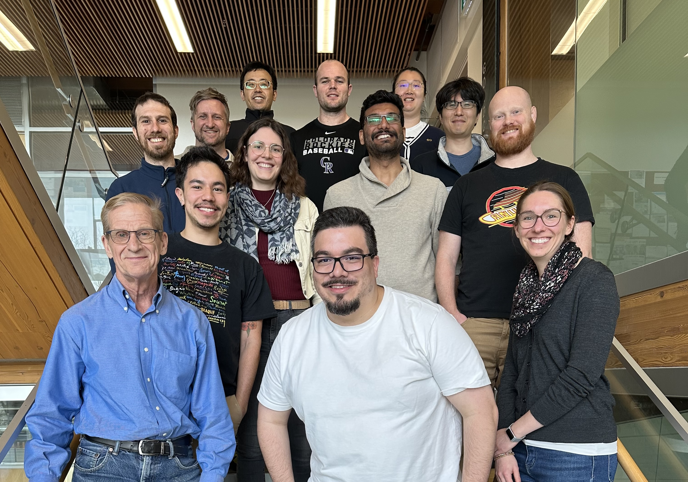

The University of British Columbia Geophysical Inversion Facility (UBC-GIF) is an academic research unit within the [Department of Earth, Ocean and Atmospheric Sciences (EOAS)](https://www.eoas.ubc.ca/) at UBC. Our research is methods-oriented and focuses on advancing numerical modelling, inversions, and machine learning for applied and environmental geophysics. We engage with industry collaborators in mineral exploration and with environmental groups. Our mission is to advance quantitative methods for using geophysical data to help solve problems that are important to society. We do this by:
* developing methods in numerical simulations, inversions, and machine learning to extract insights from geophysical data,
* advancing quantitative methods and tools that facilitate the integration of data,
* maintaining and disseminating open-source software, and
* training highly qualified geoscientists.

# Current Team

## Leadership

:::{person}
:name: Lindsey Heagy
:position: Assistant Professor, GIF director
:orcid: 0000-0002-1551-5926
:image: /images/people/LindseyHeagy.jpg
:email: lheagy@eoas.ubc.ca
:github: lheagy
:linkedin: lindsey-heagy-88318248
:::

:::{person}
:name: Doug Oldenburg
:position: Emeritus Professor, GIF founder and advisor
:orcid: 0000-0002-4327-2124
:image: /images/people/DougOldenburg.jpg
:email: doug@eoas.ubc.ca
:github: dougoldenburg
:linkedin: douglas-oldenburg-113b6718
:::

## Postdoctoral Researchers

:::{person}
:name: Santiago Soler
:position: Postdoctoral Researcher
:image: /images/people/SantiagoSoler.jpeg
:orcid: 0000-0001-9202-5317
:email: ssoler@eoas.ubc.ca
:github: santisoler
:linkedin: santiago-soler-691708361
:website: https://www.santisoler.com
:::

## Graduate Students

:::{person}
:name: Pablo Chang Huang
:position: MSc Student
:image: /images/people/PabloChangHuang.png
<!-- :orcid: 1000-0000-0000-0000 -->
:email: pchanghuang@eoas.ubc.ca
:github: pablochanghuang
:linkedin: pablo-chang-huang-arias-336852230
<!-- :website: link to personal website -->
:::

:::{person}
:name: Devin Cowan
:position: PhD Student
:image: /images/people/DevinCowan.jpeg
:orcid: 0000-0002-0089-402X
:email: dcowan@eoas.ubc.ca
:github: dccowan
:linkedin: devin-cowan-5a4810125
<!-- :website: link to personal website -->
:::

:::{person}
:name: John Kuttai
:position: PhD Student
:image: /images/people/JohnKuttai.jpg
<!-- :orcid: 1000-0000-0000-0000 -->
:email: jkutt@eoas.ubc.ca
:github: jkutt
:linkedin: johnathan-kuttai-391a4183
<!-- :website: link to personal website -->
:::

:::{person}
:name: Katharina Maetschke
:position: PhD Student
:image: /images/people/KatharinaMaetschke.png
<!-- :orcid: 1000-0000-0000-0000 -->
:email: kathim@eoas.ubc.ca
<!-- :github: ghusername -->
:linkedin: katharina-maetschke-b1507a241
<!-- :website: link to personal website -->
:::

:::{person}
:name: Masayuki Motoori
:position: MSc Student
:image: /images/people/MasayukiMotoori.png
:orcid: 0009-0006-1889-8914
:email: masayuki.motoori@eoas.ubc.ca
:github: MasayukiMotoori
:linkedin: masayuki-motoori-1aa9152b3
<!-- :website: link to personal website -->
:::

:::{person}
:name: Parth Pokar
:position: MSc Student
:image: /images/people/ParthPokar.png
:orcid: 0000-0001-5345-6173
:email: ppokar@eoas.ubc.ca
:github: pokarparth
:linkedin: pokar
<!-- :website: link to personal website -->
:::

:::{person}
:name: John Weis
:position: PhD Student
:image: /images/people/JohnWeis.png
:orcid: 0009-0003-6820-064X
:email: jweis@eoas.ubc.ca
:github: johnweis0480
:linkedin: john-weis-309407130
<!-- :website: link to personal website -->
:::

:::{person}
:name: Anran Xu
:position: PhD Student
:image: /images/people/AnranXu.png
:orcid: 0009-0001-9731-377X
:email: anranxu@eoas.ubc.ca
:github: anna1963
:linkedin: anran-xu
:website: https://anna1963.github.io/
:::

:::{person}
:name: Roman Shekhtman
:position: Research Associate
:image: /images/people/RomanShekhtman.png
<!-- :orcid: 1000-0000-0000-0000 -->
:email: rshekhtm@eoas.ubc.ca
<!-- :github: ghusername -->
<!-- :linkedin: trail-of-url -->
<!-- :website: link to personal website -->
:::

# GIF Alumni

## Graduates

:::{person}
:name: Jingrong (Mimi) Lin
:position: MSc Student (graduated 2025)
:image: /images/people/JingrongLin.jpeg
<!-- :orcid: 1000-0000-0000-0000 -->
<!-- :email: name@eoas.ubc.ca -->
<!-- :github: ghusername -->
:linkedin: mimi-jingrong-lin-291912aa
<!-- :website: link to personal website -->
:::

## Postdocs

:::{person}
:name: Marco Antonio Couto Jr.
:position: Postdoctoral Researcher (2024-2025)
:image: /images/people/MarcoCouto.png
:orcid: 0000-0002-5747-1474
<!-- :email: name@eoas.ubc.ca -->
:github: marcoutojr
:linkedin: marco-antonio-couto-jr-9b654146
<!-- :website: link to personal website -->
:::

:::{person}
:name: Jorge Lopez-Alvis
:position: Postdoctoral Researcher (2022-2024)
:image: /images/people/JorgeLopezAlvis.jpeg
:orcid: 0000-0001-8626-117X
<!-- :email: name@eoas.ubc.ca -->
:github: jlalvis
:linkedin: jorge-l%C3%B3pez-alvis-ab58b686
<!-- :website: link to personal website -->
:::

:::{person}
:name: Joseph Capriotti
:position: Postdoctoral Researcher (2021-2023)
:image: /images/people/JosephCapriotti.png
<!-- :orcid: 1000-0000-0000-0000 -->
<!-- :email: name@eoas.ubc.ca -->
<!-- :github: ghusername -->
<!-- :linkedin: trail-of-url -->
<!-- :website: link to personal website -->
:::

:::{person}
:name: Thibaut Astic
:position: Postdoctoral Researcher (2021-2023)
:image: /images/people/JosephCapriotti.png
:orcid: 0000-0003-4762-5377
<!-- :email: name@eoas.ubc.ca -->
:github: jcapriot
:linkedin: jcapriot
<!-- :website: link to personal website -->
:::

<!-- ## GIF 1.0 graduates -->

